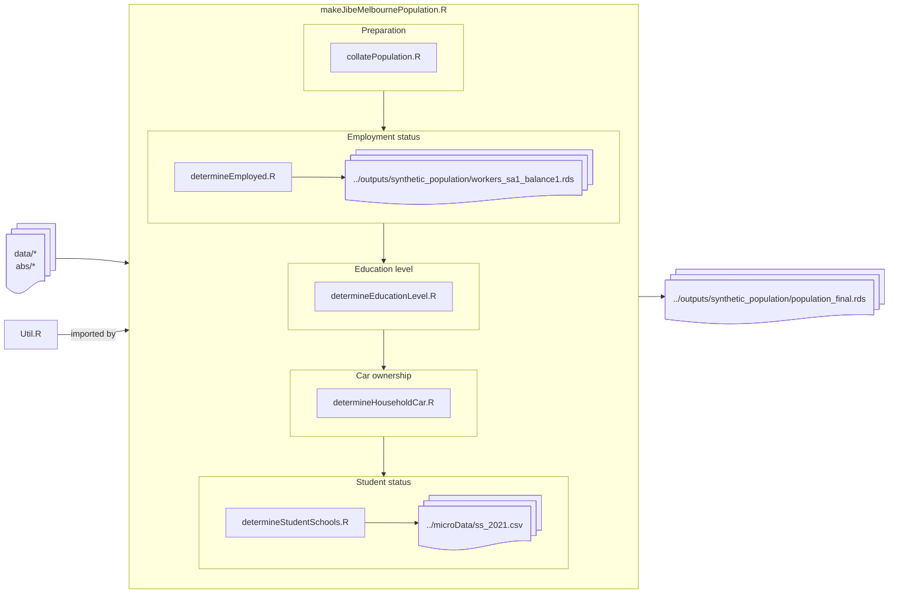

# syntheticPopulationMelbourne
Code for generating the synthetic population for the JIBE Melbourne model.

## Status
As of 2025-04-14 the refactored synthetic population workflow has been validated to generate work and student statuses etc, and all associated worker allocation files as generated previously (with addition of student status/school allocation).

Further updates are pending to address output in format for [MiTO](https://github.com/jibeproject/mito) and [SILO](https://github.com/jibeproject/silo) purposes)

## Requirements
- R 4.0.0 or higher
- R packages: `install.packages(c('tidyverse','data.table','sf','furrr','logger','stringr','igraph','future')`
- for JIBE team, copy content of `data` and `abs` folders from the JIBE Melbourne model repository to the same directory as this repository. 

## Usage
- clone this repository to the `melbourne` folder of the JIBE Melbourne model
- open a terminal to the repository directory
- run the following command to generate the synthetic population:
```bash
Rscript ./makeJibeMelbournePopulation.R
```

## Output
Results are output to the following folders:
- `../output/synthetic_population`
- `../microData`

## Workflow 

