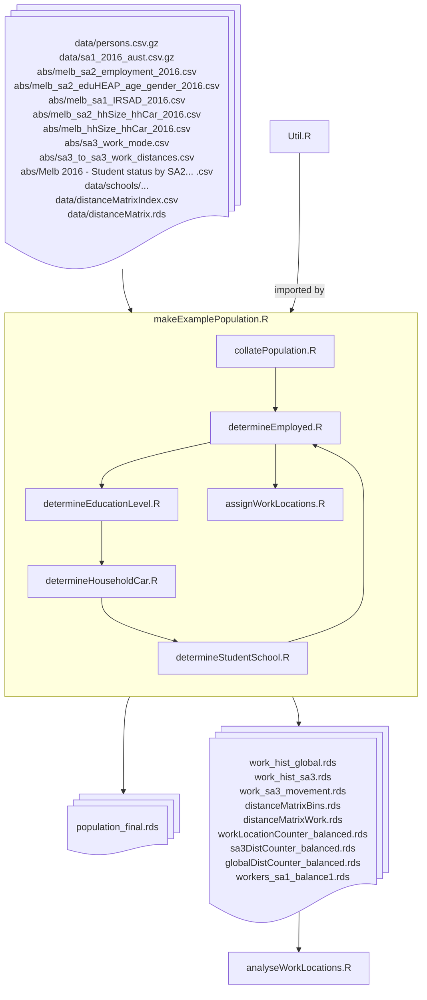

# syntheticPopulationMelbourne
Code for generating the synthetic population for Melbourne

```mermaid
flowchart TD
    subgraph makeExamplePopulation.R
        direction TB 
        collatePopulation.R -->
        determineEmployed.R -->
        determineEducationLevel.R -->
        determineHouseholdCar.R -->
        determineStudentSchool.R -->
        determineEmployed.R -->
        assignWorkLocations.R
    end
    input@{ shape: docs, label: "data/persons.csv.gz\ndata/sa1_2016_aust.csv.gz\nabs/melb_sa2_employment_2016.csv\nabs/melb_sa2_eduHEAP_age_gender_2016.csv\nabs/melb_sa1_IRSAD_2016.csv\nabs/melb_sa2_hhSize_hhCar_2016.csv\nabs/melb_hhSize_hhCar_2016.csv\nabs/sa3_work_mode.csv\nabs/sa3_to_sa3_work_distances.csv\nabs/Melb 2016 - Student status by SA2... .csv\ndata/schools/...\ndata/distanceMatrixIndex.csv\ndata/distanceMatrix.rds"}--> makeExamplePopulation.R
    Util.R--imported by-->makeExamplePopulation.R
    makeExamplePopulation.R -->
    population@{ shape: docs, label: "population_final.rds"}
    makeExamplePopulation.R -->
    workData@{ shape: docs, label: "work_hist_global.rds\nwork_hist_sa3.rds\nwork_sa3_movement.rds\ndistanceMatrixBins.rds\ndistanceMatrixWork.rds\nworkLocationCounter_balanced.rds\nsa3DistCounter_balanced.rds\nglobalDistCounter_balanced.rds\nworkers_sa1_balance1.rds"} -->
    analyseWorkLocations.R
```
